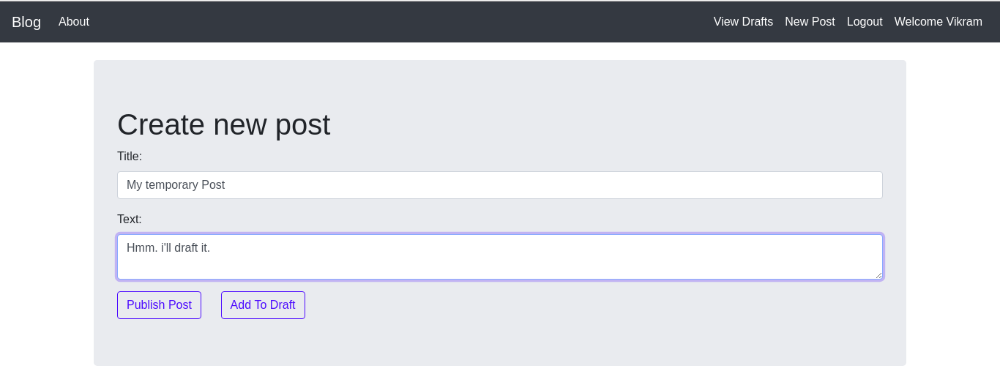

# Mini Blogging Website
A blogging website created entirely using **HTML, Bootstrap and python's Django Framework.**
This small website allows user to register and login and write small blogs. 

Users Can view other users post and share their comment on it.

* Users can view posts even if they have not logged in.


* Clicking on a post displays the content of the post. The post is visible to non registered users as well


* If the user is viewing his/her own post then the website allows functionality to **Edit** and **Delete** the post.


* Users Can choose not to publish the post right away. Instead draft it for later.



* Users can view their drafted posts and then publish it.


# How to Run
* Make Sure django version 3.0 is installed. (The project will run in virtualenv as well)
* Download/Clone the project
* Go to *Mini-Blogging-Website/blog_project/*
* Run the following command to start the server
* ``` python manage.py runserver```
* Visit the Link.


